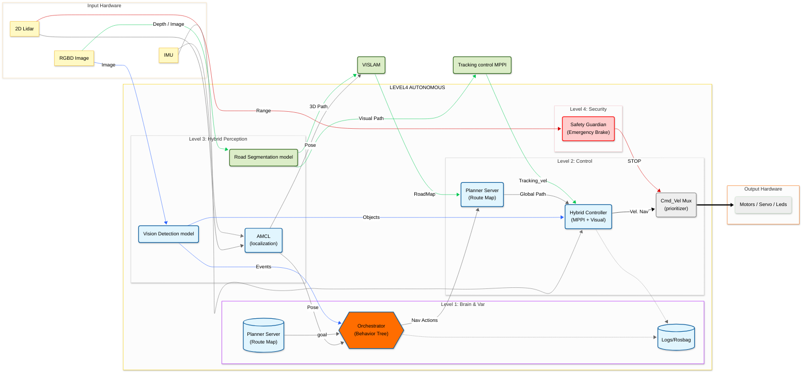

# LaneSeg-ACC

<<<<<<< HEAD
Proyecto orientado a la segmentación y detección de carriles (lane detection / lane segmentation) para aplicaciones de conducción autónoma y robótica móvil.

## Enlaces de interés y referencias

### Sistemas y pipelines completos
- **Self-driving-ish Computer Vision System**  
  https://github.com/iwatake2222/self-driving-ish_computer_vision_system

### Modelos y métodos de detección de carriles
- **Ultra-Fast Lane Detection**  
  https://github.com/cfzd/Ultra-Fast-Lane-Detection

- **Lane Detection con U-Net**  
  https://github.com/AnshChoudhary/Lane-Detection-UNet/tree/main

- **PriorLane**  
  https://github.com/vincentqqb/PriorLane

- **PersFormer – 3D Lane Detection**  
  https://github.com/OpenDriveLab/PersFormer_3DLane

### Transformers y segmentación semántica
- **Fine-Tuning SegFormer para Lane Detection (BDD100K)**  
  https://github.com/spmallick/learnopencv/blob/master/Fine-Tuning-SegFormer-For-Lane-Detection/Fine-Tune-SegFormer-BDD.ipynb

- **SegFormer preentrenado (Cityscapes – NVIDIA TAO)**  
  https://catalog.ngc.nvidia.com/orgs/nvidia/teams/tao/models/pretrained_segformer_cityscapes?version=deployable_fan_tiny_hybrid_v1.0

### ROS 2 y NVIDIA Isaac
- **Isaac ROS – Image Segmentation**  
  https://github.com/NVIDIA-ISAAC-ROS/isaac_ros_image_segmentation

### Colecciones y listas curadas
- **Awesome Lane Detection**  
  https://github.com/Core9724/Awesome-Lane-Detection

- **Lane Detection – Awesome List**  
  https://github.com/xukun-zhang/Lane-Detection-awesome-lane-detection


  Propuesta 1:
  


=======
steps:

## Instalar cupy para cuda 11

  ```bash
  pip install cupy-cuda11x
  ```
Test:
  ```bash
  python3 utils/test_cupy.py
  ```


## Compile Isaac ros2.1 from source using colcon

  ```bash
    
  git clone -b release-2.1 https://github.com/NVIDIA-ISAAC-ROS/isaac_ros_dnn_inference.git
  git clone -b release-2.1 https://github.com/NVIDIA-ISAAC-ROS/isaac_ros_image_pipeline.git
  git clone -b release-2.1 https://github.com/NVIDIA-ISAAC-ROS/isaac_ros_nitros.git
  git clone -b release-2.1 https://github.com/NVIDIA-ISAAC-ROS/isaac_ros_image_segmentation.git

  colcon build --symlink-install --packages-up-to isaac_ros_tensor_rt isaac_ros_dnn_image_encoder isaac_ros_nitros

  colcon build --symlink-install --packages-up-to qcar2_autonomy qcar2_interfaces qcar2_nodes qcar2_lane_following


  edit file: run_dev.sh

  # Run container from image
  print_info "Running $CONTAINER_NAME"
  docker run -it --rm \
      --privileged \
      --network host \
      ${DOCKER_ARGS[@]} \
      -v $ISAAC_ROS_DEV_DIR:/workspaces/isaac_ros-dev \
      -v /dev/*:/dev/* \
      -v /etc/localtime:/etc/localtime:ro \
      --name "$CONTAINER_NAME" \
      --runtime nvidia \
      --gpus all \
      --ulimit memlock=-1 \
      --ulimit stack=67108864 \
      --shm-size=4g \
      --user="admin" \
      --group-add render \
      --device /dev/dri:/dev/dri \
      --entrypoint /usr/local/bin/scripts/workspace-entrypoint.sh \
      --workdir /workspaces/isaac_ros-dev \
      $@ \
      $BASE_NAME \
      /bin/bash


  edit file: Dockerfile.quanser
      #RUN echo "source /workspace/cartographer_ws/install/setup.bash" >> /home/admin/.bashrc

  ```
>>>>>>> origin/image_processing
